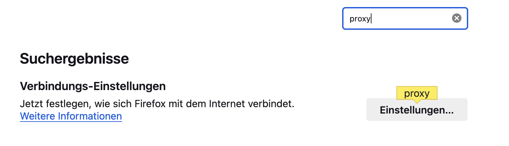
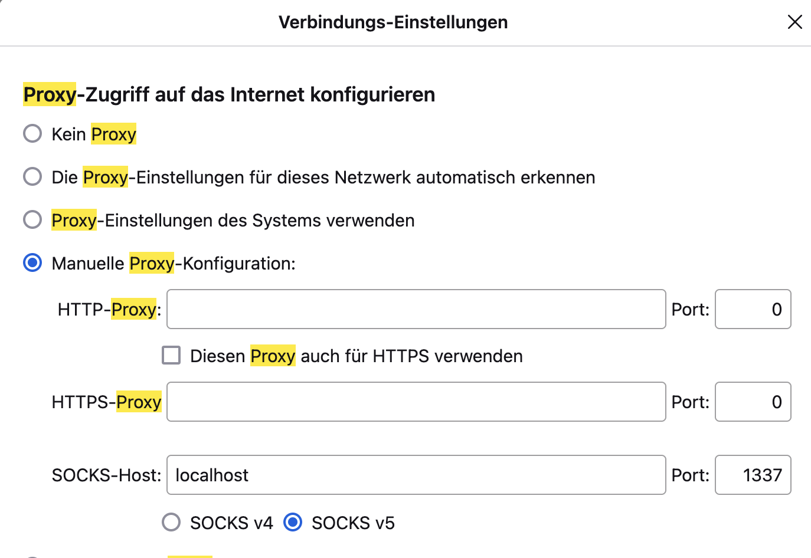

+++
title = 'How to Create Your Own VPN Using Amazon Web Services'
date = 2024-05-09T19:10:35+02:00
draft = true
+++

In this post, we will explore how to easily create a proxy tunnel to route network traffic to an EC2 instance located in an AWS data center. This tutorial was inspired by NetworkChuck.

Setting up the VPN is straightforward once you know the commands.

## Disclaimer
Please note that this tutorial only works with the Firefox web browser. You are welcome to try it with other web browsers, but there is no guarantee it will work as expected.

## Setup
To make our VPN work, we need three things: an EC2 instance, the Firefox browser, and a new terminal session. Essentially, we will create an SSH tunnel that directs traffic from our local machine to the EC2 instance in an Amazon data center. This allows us to browse the internet as if we were surfing from an Amazon data center. One useful use case for this is accessing services that are not available in your region.

## Launching an AWS EC2 Instance
To launch a minimal EC2 instance, follow these steps:

1. Open the AWS Management Console and go to the EC2 service.
2. Click on "Launch Instance" to start the instance creation process.
3. Choose an Amazon Machine Image (AMI) that suits your needs. For a minimal instance, you can select a basic Linux AMI.
4. Select an instance type based on your requirements. For a minimal setup, a t2.micro instance will suffice.
5. Configure the instance details, such as the number of instances, network settings, and storage options. Keep the settings minimal for this setup.
6. Add any additional storage or tags if needed.
7. Configure the security group to allow SSH access to the instance.
8. Review the instance details and click on "Launch" to start the instance.
9. Choose an existing key pair or create a new one to securely connect to the instance via SSH.
10. Once the instance is launched, you can obtain the public IP address or DNS name to access it.

By following these steps, you will be able to launch a minimal EC2 instance on AWS.

## Connecting to the EC2 Instance
To connect to the previously created EC2 instance, start a new command line session and navigate to the folder where the SSH key pair is located.

Before running the SSH command to connect to the instance, you need to change the permissions of the key pair file. Use the following command:
```shell
chmod 400 keypair.pem
```
Note that this command works on Unix-based operating systems. If you are using Windows, you will need to find an equivalent command.

After modifying the permissions of the key pair, the only thing left to do is to connect to the remote instance using SSH:

```shell
ssh -i keypair.pem ubuntu@ec2-54-196-55-15.compute-1.amazonaws.com
```
This is just one example. You can find the correct IP address of your instance by clicking on the "Connect to Instance" field and copying the SSH command.

After succesfully connecting to the EC2 instance just leave the terminal open and open a new terminal session parallel to that one. 

In that terminal we are going to establish the SSH tunnel from our local machine towards the EC2-instance. 

## Establishing a SSH-Tunnel from the local machine to the remote instance
In the newly created terminal session run the following command:
```shell
ssh -D 1337 -N -C -i "proxyServer.pem" ec2-user@ec2-user@44.220.158.69
```

The `ssh` command is used to initiate a secure shell (SSH) connection to a remote server.

- `-D 1337`: This option specifies dynamic port forwarding and sets the port number to 1337 for the forwarding.
- `-N`: This option tells SSH not to execute any remote commands after connecting, useful for establishing the SSH connection for port forwarding purposes.
- `-C`: This option enables compression during the SSH connection, improving data transfer performance.
- `-i "keypair.pem"`: This option specifies the identity file used for authentication, in this case, "proxyServer.pem".
- `ec2-user@ec2-user@44.220.158.69`: This is the username and IP address (or hostname) of the remote server to connect to. In this case, the username is "ec2-user" and the IP address is "44.220.158.69".

When running this command, it establishes an SSH connection to the remote server at IP address "44.220.158.69" using the username "ec2-user". It sets up dynamic port forwarding on port 1337, enables compression, and uses the "proxyServer.pem" file for authentication.

This command is commonly used to create a secure tunnel between a local machine and a remote server, allowing secure access to resources on the remote server through the local machine. Dynamic port forwarding enables forwarding network traffic from the local machine through the SSH connection to the remote server.

Now the proxy tunnel has been set up succesfully. The only thing missing is to setup our firefox browser to tunnel the traffic to port 1337.

## Configuring Firefox to tunnel traffic through port 1337
To set up Firefox to tunnel traffic through port 1337, follow these steps:

1. Open your Firefox browser and navigate to the settings tab.

2. In the search bar, enter the keyword "proxy" and click on the corresponding settings option.

3. In the proxy settings, configure the necessary parameters to tunnel the traffic through port 1337.

4. Save the settings.

Once you have completed these steps, you have successfully set up a proxy tunnel to the remote instance. You can now browse the web with the location being the remote instance's data center.


