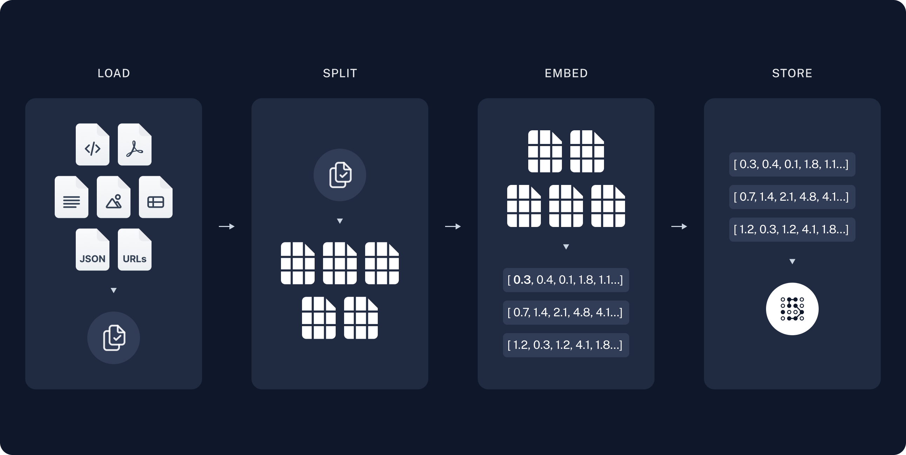

+++
title = 'Creating a QA Application using LangChain'
date = 2024-06-15T12:39:02+02:00
draft = true
+++
In this project, we will be implementing a simple application that enables us to perform Question-Answering (QA) on a given document using Retrieval Augmented Generation (RAG). Specifically, we will be using a subset of the Serbian construction law as our dataset for performing QA tasks. Furthermore we are also going to deploy our application to the Google Cloud enabling other Users to gain access to our ChatBot via a publicly available link.

## What is Retrieval Augmented Generation
Retrieval Augmented Generation is a powerful technique used to enhance the knowledge of Large Language Models (LLMs) by incorporating additional data. While LLMs have extensive knowledge on a wide range of topics, their training data is limited to a certain point in time. This means that there is a possibility that the model has not been trained on a specific document you want to ask questions about.

This is where RAG proves to be invaluable. It allows us to provide relevant information along with the user prompt to the LLM, enabling it to generate accurate answers. By leveraging RAG, we can bridge the gap between the existing knowledge of LLMs and the specific document we want to analyze. 


## Components of a RAG Application

A typical RAG Application consists of two main components. The first part is called "Indexing". During this phase, we load and ingest our data from the source and index it into a Vectorstore. This process usually takes place offline.

The second part is called "Retrieval and Generation". In this phase, we pass the user query to our index, retrieve all the relevant information, and then prompt this information to the LLM (Large Language Model) to generate an appropriate answer.

By dividing the RAG Application into these two components, we can efficiently manage the data and ensure accurate and timely responses to user queries.

We can split the Workflow of our RAG Pipeline into 5 steps.
### Indexing 
1. **Load**: We are first going to load out data into a suitable format for indexing using a _DocumentLoader_ 

2. **Split**: We will divide the loaded data into smaller chunks to facilitate searching in the Vector space where it will be embedded. In this project we are going to use the _RecursiveTextCharacterSplitter_

3. **Store**: In this step, we will utilize a VectorStore to store our data chunks. To achieve this, we will employ an embeddings model. Essentially, we preprocess the data chunks and embed them into a VectorSpace using the chosen embeddings model, which in this case is provided by Google. This enables us to perform operations such as finding the k-nearest neighbor to a Vector.

*Figure 1: Visual representation of the Indexing Workflow.*
*Source: https://python.langchain.com/v0.2/docs/tutorials/rag/*

## Retrieval and Generation
4. **Retrieve**: The user prompts an input to our model. Using a _Retriever_, we search for the k nearest neighbors in the Vector Space.

5. **Generate**: Based on the retrieved data from the previous steps, we pass a prompt to a LLM (Large Language Model) that includes the following:
- A _prompt_ that provides instructions on the behavior of the LLM.
- The _question_ prompted by the user.
- The retrieved information from the retriever, also known as the _context_.


*Figure 2: Visual representation of the Retrieval and Generation Workflow.*

*Source: https://python.langchain.com/v0.2/docs/tutorials/rag/*


# Building the RAG Application
# Explaining the Source Code

In this section, we will provide a detailed explanation of the source code for the application. We will walk you through each part of the code, highlighting the functionalities and how they work together. LangChain provides predefined functions that handle the complex processes happening in the background. Our focus will be on understanding how to combine these functionalities to create a functional application. It's important to note that the code snippets presented here are not the only way to implement such an application. There are multiple approaches that could have been taken.


## Deep dive into the Source Code

### Loading Markdown data into a Document object

```python
markdown_path = "./data.md"

loader = UnstructuredMarkdownLoader(markdown_path)
docs = loader.load()
```

Here, we are utilizing the _UnstructuredMarkdownLoader_ provided by the LangChain Library, which is being used in this project. DocumentLoaders are responsible for loading data from a source and returning a list of Document objects that contain both the _page_content_ and _metadata_.

In our code, we are loading the data located in the repository from the file named _data.md_. To convert the original _.txt_ files to the _.md_ format, we used the [pandoc](https://pandoc.org/) tool.

Finally, we load the document into a variable using the _loader.load()_ function.

### Split the document into chunks
```python
text_splitter = RecursiveCharacterTextSplitter(chunk_size=1000, chunk_overlap=200, add_start_index=True)
splits = text_splitter.split_documents(docs)
```

In our project, we will use the "RecursiveCharacterTextSplitter" function to divide our document into chunks of size 1000. The chunk overlap is set to 200, ensuring that related statements are not split apart. These chunks will then be embedded into a VectorSpace.

### Setting up the Vector Store
```python
embeddings = GoogleGenerativeAIEmbeddings(model="models/embedding-001")
    
vectorstore = Chroma.from_documents(documents=splits, embedding=embeddings)
```
In this code snippet, we are creating a vector store where we will embed the previously created chunks. The vector store is created using Chroma, an AI-native open source vector database. We pass two parameters to the function: "documents" representing the chunks and "embedding" representing an embedding model. The embedding model formats the data appropriately for our LLM. Since we are using Google's LLM, we have created a suitable embeddings model for it.

### Setting up the retriever
```python
retriever = vectorstore.as_retriever(search_type="similarity", search_kwargs={"k": 6})
```
In the code snippet above, we are defining a retriever for the VectorStore. LangChain provides a Retriever Interface, which encapsulates an index that retrieves relevant documents from the VectorStore based on a query string. In this code snippet, we are configuring the retriever to perform a similarity search and retrieve the 6 nearest neighbors to the query string.

### Generating the final output

First we are going to set a prompt, giving instructions to the model on how to behave when answering the questions.

```python
system_prompt = (
    "Vi ste asistent za zadatke odgovaranja na pitanja."
    "Koristite sledeće delove dobijenog konteksta da odgovorite na pitanje."
    "Ako ne znate odgovor, samo recite da ne znate."
    "Koristite najviše tri rečenice i neka odgovor bude sažet. "
    "Sve odgovore koje generišete, generišite molim Vas na srpskom jeziku."
    "\n\n"
    "{context}"
)
```

In the context placeholder we are later going to insert the retrieved context from our VectorStore after the user has prompted his question. 

Next we are going to create a ChatPromptTemplate, which is additionaly going to save the user question, pass it to the retriever inside our chain and save the retrieved context in the context variable. 

```python
prompt = ChatPromptTemplate.from_messages(
        [
            ("system", system_prompt),
            ("human", "{question}"),
        ]
    )
```

Now we have arrived at the main part of our code, the chain which basically chains all parts of the code which have just been discussed together.

```python
    chain = (
    {"context": retriever | format_docs, "question": RunnablePassthrough()}
    | prompt
    | llm
    | StrOutputParser()
    )
```
Each of the components in the chain are instances of the _Runnable_ interface, meaning that they all implement the same methods. We are chaining the components together using a pipe. 
Basically what is happening here is that we chain the outputs of one Runnable into the input of another. So we take the user question, pass it to the retriever and save that output in the context variable. We have also defined a helper function called _format_docs_ which formats our chunks. After that we have crafted our two input variables for our prompt dictionary and we pipe them into the prompt, generating a full prompt with _context_, _question_ and the instructions from the _system_prompt_. The prompt is the being passed to the LLM of our choice, in this case it is Googles LLM. 

The output received from our LLM is passed using the _StrOutputParser()_ and the following loop iterates through each chunk and saves it into the output. 

```python
    output = ""
    for chunk in chain.stream(question):
        output += chunk
    return output
```


